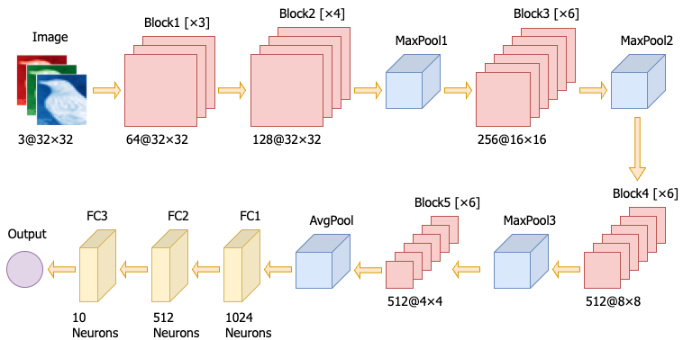
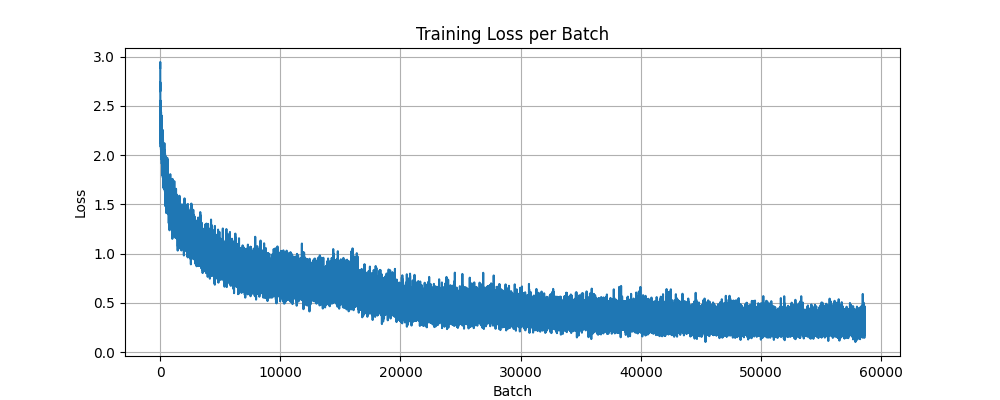
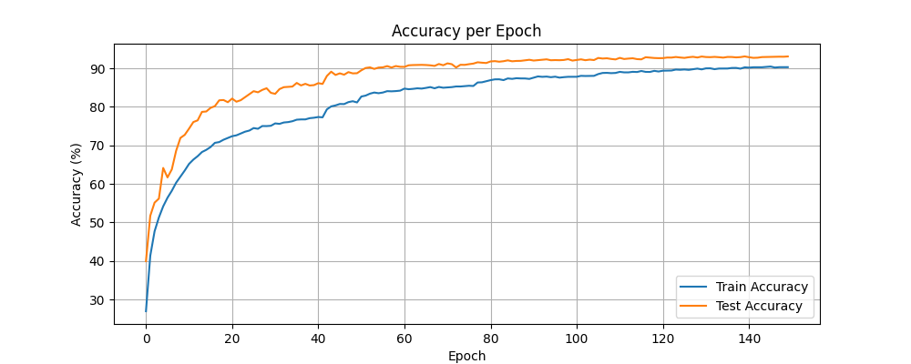

## Dataset Description
The CIFAR-10 dataset is composed of 60000 small (3 × 32 × 32) color images, each of which belongs to one of 10 classes. There are 6000 images per class. The images are divided into a training dataset composed of 50000 examples and a testing dataset composed of 10000 examples. This dataset is readily available for *PyTorch*.

## Neural Network Architecture
The architecture consists of **5 convolutional blocks** followed by **three fully connected output layers**. The convolutional blocks progressively increase in depth and width, with:
* Number of convolutional layers per block: 3, 4, 6, 6, and 6
* Corresponding output channels: 64, 128, 256, 512, and 512
* Total parameters: 24,687,971

Each convolutional layer uses a 3×3 kernel with padding 1. Max pooling layers (kernel size=2, stride=2) are inserted after the 2nd, 3rd, and 4th blocks to reduce spatial dimensions gradually. The output block uses global average pooling followed by a classifier composed of two fully connected layers with 1024 and 512 units respectively, ending with a final classification layer with 10 outputs.

  
  
<strong>Figure 1: Custom CNN Architecture</strong>

## Hyperparameters and Training Techniques

### 1. Hyperparameters
* **Batch size:** 128
* **Initial learning rate:** 0.001
* **Weight decay:** 2e-4
* **Optimiser:** Adam
* **Number of epochs:** 150
* **Learning rate schedule:** ReduceLROnPlateau (factor=0.5, patience=5)
* **Early stopping:** when learning rate < 1e-6

### 2. Network Architecture Parameters
* Number of intermediate blocks: 5
* Convolutional layers per block: B1(3), B2(4), B3(6), B4(6), B5(6)
* Kernel size: 3×3
* Padding: 1

### 3. Data Augmentation
To improve generalisation, the following augmentations were applied on the training set:
* Random cropping (32×32 with padding=4)
* Random horizontal flipping
* Random rotation (±15°)
* Color jitter (brightness, contrast, saturation, hue adjustments)
* RandAugment (2 operations, magnitude=9)

### 4. Normalisation
Applied to both training and test datasets:
* Mean: (0.4914, 0.4822, 0.4465)
* Standard deviation: (0.2023, 0.1994, 0.2010)

### 5. Regularisation Methods
* L2 regularisation (2e-4)
* Dropout: 0.2 between blocks, 0.4 in the classification head
* Batch Normalisation throughout the network

## Training Results
The model achieved the highest test accuracy of **93.08%** on the CIFAR-10 test dataset.

<table>
  <tr>
    <td></td>
    <td></td>
  </tr>
  <tr>
    <td align="center"><strong>Figure 2: Loss per Training Batch</strong></td>
    <td align="center"><strong>Figure 3: Training and Testing Accuracy per Epoch</strong></td>
  </tr>
</table>
